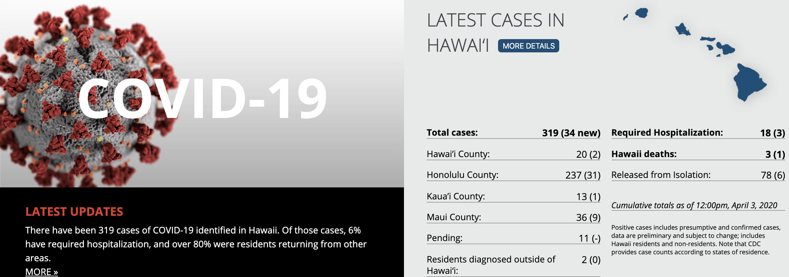
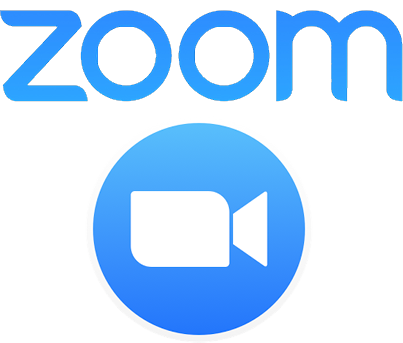

## COVID-19 Takes Over the World!

The world today is a scary and unprecedented place. The lives of everyone are at stake as a new disease - coronavirus aka COVID-19 - takes the world by storm. Millions of lives have been impacted in the worst ways possible. Without a proven vaccine available, many are on the front line trying to help patients in any way possible. Numerous events have been canceled, including at the University of Hawaii. On March 18, 2020, all courses were moved to an online format for the remainder of the semester and into the first summer session. This was mandated in order to prevent the spread of the virus and to practice social distancing. 

Over the past few weeks, my life has changed drastically. The virus came as a major disruption. As a college student, I enjoy physically attending classes and am used to being on campus for more than 12 hours on some days, even though I do not dorm. In terms of my daily routine, I used to attend classes every day starting at 8:30am in the morning with a jam-packed schedule of back-to-back work and classes for 8+ hours every school day of the week (except Monday), with at most a 15-minute break in between. I looked forward to meeting up with fellow classmates every Monday on campus to study at the library, grab food, socialize, and exercise at the Warrior Recreation Center. I am taking 6 classes this semester. In some, my course load has increased exponentially with new assignments, quizzes, readings, and lectures every day. However, I know that it has been a struggle for professors to change their style of teaching and move all resources online. Although I miss seeing my classmates and professors, it is in best practice that we take precautions. I still get ready for each day, as I hope that the virus does not infect any of us.

## Ok, Zoomer

In order to continue the flow of education via learning, many of my courses are using [Zoom](zoom.us), a video conferencing application, to meet during lecture times or for office hours. Additionally, I use Zoom to assist ICS students during my job as a Learning Assistant for ICS 141 and a UH Manoa College of Natural Sciences ICS tutor for students taking computer science courses. I find this application really effective and fun to use. I enjoy having the ability to gain knowledge through this distance learning environment. 

Additionally, it helps me feel connected to my peers and teachers while true face-to-face interaction is not a current possibility. Zoom also has neat features such virtual backgrounds, controlled screensharing, and chat rooms. It is nice to see that collaboration and unity is still promoted through this lockdown. 

## Powering Through Adversity

In this time of major uncertainty, I strive to move forward my remaining positive and motivated. It is essential to check Laulima, emails, Slack, and other means of communication in order to keep up with tasks and finish the last several weeks of school year strong. I am thankful that I do not portray any symptoms nor have I knowingly come into contact with anyone that has been plagued with the coronavirus. In order to take extra safety measures, I have also listened to the [Center of Disease Control and Prevention's guidelines](https://www.cdc.gov/coronavirus/2019-ncov/prevent-getting-sick/prevention.html) on how to remain vigilant and stop the spread. I have been frequently washing my hands while maintaining a clean hygiene, staying 3 feet away from others, remaining at home, sanitizing surfaces, using gloves and masks when necessary, and not touching my face. 

I have grown closer to my family and have been checking in on my grandparents frequently. I stay in contact with my friends and applaud those in the community who are making a difference. I gained a great appreciation for all of the blessings and freedoms that we have in life. I really value every professor, healthcare worker, and anyone assisting those affected. 

>*"All the adversity I’ve had in my life, all my troubles and obstacles, have strengthened me…. You may not realize it when it happens, but a kick in the teeth may be the best thing in the world for you."*
-Walt Disney

This quote depicts the significance of having strength and hope during these tough times. Stay safe and healthy.
