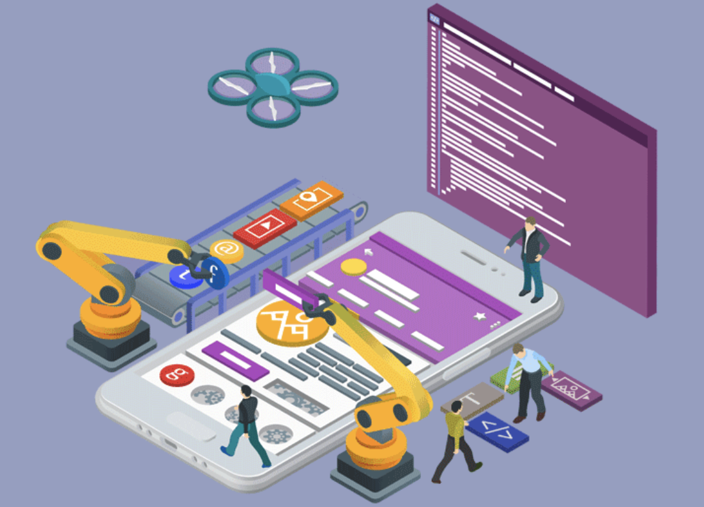
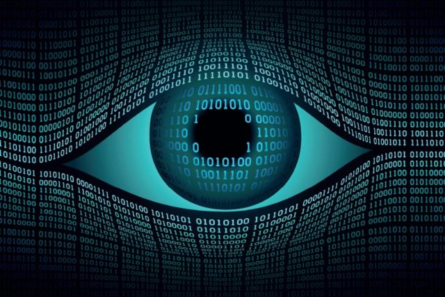

## E for Ethics in Software Engineering
In the context of software engineering, ethics are principles that shape how a professional software engineer should conduct themselves, as well as how their projects should be morally created. Due to the fact that code is implemented in machinery, such as autonomous vehicles and medical equiptment, it is vital that the engineers behind the product take full precautions in order to ensure that only good results occurr from each use. Software engineers should act and program righteously. Since people may have different ideas on what "doing good" is, the ACM Code of Ethics and Professional Conduct and the IEEE Code of Ethics has be implemented and enforced. Additionally, from ICS 390: Ethics in the Information Age, I learned that the following ethical theories and frameworks are acceptable to be used to evaluate the ethicality of a given situation: Virtue Ethics, Social Contract Theory, Kantianism, Rule Utilitarianism, and Act Utilitarianism.

 

## The Private I in PrIvacy

## The Verdict
