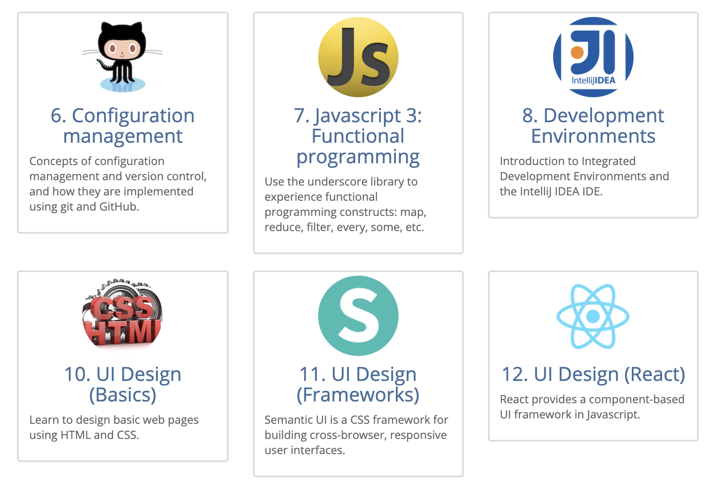

## The Software Engineering Journey
Throughout the course of the Spring 2020 Semester, I had the privilege to learn a variety of software engineering concepts, such as problem analysis and design, team-oriented development, quality assurance, configuration management, and project planning. This class taught a lot more than just web application development. Through it, I learned how to be a better programmer and person. I discovered the importance of design patterns, ethics, agile project management, coding standards, open source software development, functional programming, development environments, and user interface frameworks. In general, software engineering is was an intricate discovery of knowledge filled with hands-on experiences as well as trial and error. There are numerous aspects and tools of the trade. In order to produce successful projects, testing must be conducted to ensure that there are no bugs and that everything runs smoothly. 

### Coding Standards
Beyond web application development, learning the main idea behind coding standards encourages people to double-check their work, refrain from making errors, and write to that the world may understand you as well. Without coding standards, users may be left in the dark if their code structure is accurate or not. This is similar to spelling and grammar checks in Microsoft Word when writing essays. Similar to the use of ESLint, Grammarly uses natural language processing and artificial intelligence to assist users in creating mistake-free research papers, emails, and anything that involves sentences. Instead of seeing a green checkmark in the righthand corner of the screen, users see a green circle. If a paper does not comply with MLA or APA format, then the composition is not acceptable. Additionally, if there are a lot of errors in code, then it will not load properly. If we do not follow the standards of transmitting information and thought through words and care enough to be detail-oriented, and then its importance is belittled. 

Understanding coding standards helps with communication, quality assurance, confidence, styling, paying attention to specifics, legibility, and expression. It helps us retain good habits. Each language has their own way of writing and sentence structure, similar to how there are different ways to write code. Having proper code is aesthetically pleasing and improves the program’s quality. Writing appropriately formatted code is a great technique that all software engineers should incorporate. Coding standards are very important. When everyone follows the guidelines, then we can better recognize how a program operates when reading other code. Absorbing all of the knowledge on how to suitably write code may be tedious, but it is exceptionally beneficial in the long run. Studying how code should be written definitely helps one to become skilled at a programming language. I completely enjoy learning how use creativity while coding but also abiding by the coding standards.

Although there are multiple ways to write a program that results in the same output, having a consistent style of writing is vital in ensuring that code is legible and decipherable by all. When multiple software engineers are coding a project together, having a similar method of writing code prevents conventions, disorderliness, and mistakes such as mixing up variable names or forgetting a bracket. With a proper implementation of coding standards, complexity is minimized, the probability of errors and failure are reduced, and ease of maintenance is certified. Additionally, coding standards and ESLint aids software engineers in practicing the best way to implement professional code and improve readability

### Agile Project Management

The skills I acquired this semester will help me in continuing to write technical essays, code with JavaScript, HTML, and CSS, enhance my professional persona, effectively use techniques, behave righteously, work with IntelliJ and Chrome Developer Tools, design with UI frameworks such as React, Meteor, and MongoDB to make sites both aesthetically pleasing and easy to navigate, apply design patterns, and appropriately deploy software.

