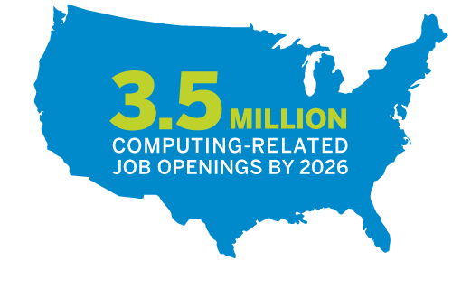
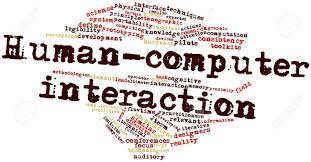
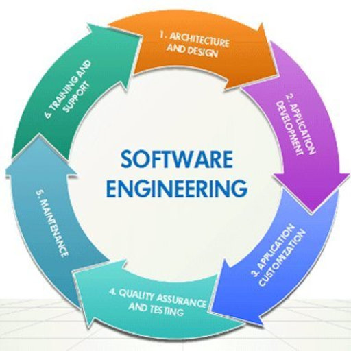

## Aspire to be an IT Girl
My interest in coding began in high school as an AspireIT peer-leader. I wanted to encourage others to create codes of fun that achieve simple tasks. By leading an afterschool coding camp that achieved creative animations, I was able to share my interest in coding with others. In high school, I was a leader for a Chinese immersion program and assisted with the robotics challenge. In the summer of 2015, I was invited to the National Congress of Future Science and Technology Leaders in Boston, MA, where I confirmed my desire to go into computing and technology. It was three full days of inspiring STEM speakers and demonstrations from several Nobel Prize medalists, University Deans, Google, Foursquare, Academy Award winners, and young prodigies showing that I can use technology to help others. With every research and service project, I will enthusiastically devote my heart and time to aiding those in need and discovering new solutions to challenges. 

## Modernizing Software
The next step is to approach software engineering by combining theoretical and practical design and development strategies from engineering and computer science. Modeling design-based algorithms combined with data structures compose analytical and problem-solving procedures that enable the creation and maintenance of applications. Software Engineering is a fascinating field of study that gives humanity tools to have their ideas come to life. Through this, websites and applications can be created to progress society forward. I am excited to develop my professional persona and learn how to implement computer-based systems. I am very interested in learning how to code in different languages such as Java, JavaScript, HTML, and CSS. This allows programmers to be fluent in the typing languages. My appreciation for the arts correlates with how tools such as IntelliJ, Chrome Developer Tools, and LiveReload may be used when designing webpages. 

## Software Engineering + AI = The Future
The interdisciplinary combination of human language and machine learning through understanding mental and behavioral functions of the mind and building theoretical processes into machine language is mesmerizing. My goal is to further my discoveries in AI and its association with linguistics to make a positive impact. Discovering how AI benefits global societies and economies through protection-based applications preventing Internet hacking fascinates me. Therefore, in order to advance development in cybersecurity, I would apply AI technologies, programming, and research as a solution. I am interested in helping to solve a world problem by strengthening cybersecurity and reducing attacks on exposed systems through AI design and analysis of neural networks and deep learning of big data containing structured and unstructured data. I aspire to continue my discoveries through specific coursework to acquire more knowledge about ethical and responsible application development. I imagine computers with maximum understanding capabilities communicating as fully functioning autonomous technology, elite facial recognition systems, industrial robots, impeccable tumor detecting machines, and highly developed search engines. 

## Software Life Cycle
The application lifecycle revolves around quality compliant design specifications that create a continuous review, maintenance, analysis, and testing of software functions. Producing creative software that is easy for humans to interact with is a challenging process for software teams.

>*"Simple can be harder than complex: You have to work hard to get your thinking clean to make it simple. But it’s worth it in the end because once you get there, you can move mountains."*
-Steve Jobs

This quote motivates me to acquire the design and implementation skills necessary to achieve successful projects that solve real-world problems.

## My Future === Software Engineering
As I continue my pursuit of a B.S. in Computer Science at the University of Hawaii at Manoa, I hope to obtain a plethora of skills and experiences that will allow me to ignite passion in future programmers while designing and developing software systems. 

Q: What does the future have in code for me?

A: Software Engineering
