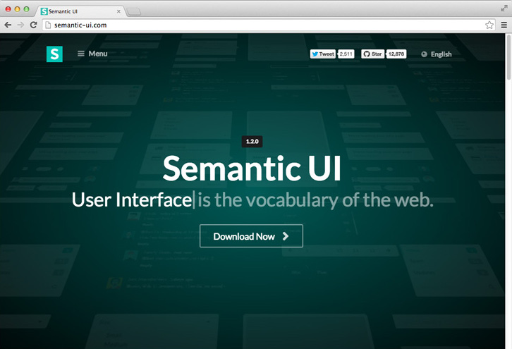

## Sematic UI Framework - It Works!

The Semantic UI (User-Interface) framework is complex. However, it allows programmers to take websites that they are developing to the next level. With Semantic UI, aesthetically pleasing designs can be brought to the worldwide web. Due to this, raw HTML and CSS documents are utilized in order to transform basic webpages into beautifully crafted sites. My first experiences with Semantic UI on PluralSite was an insightful experience where I gained information about the implementation of elements, collections, dropdown menus, and more. I enjoy attempting to re-create sites using my new knowledge. Although learning UI frameworks is as intricate as learning new programming languages, the daunting task is worthwhile. Semantic UI is fun to operate and write code with. Seeing webpages come to life is exhilarating and satisfying. 

## Wow!

“Wow” was my first reaction when learning that Semantic UI can turn a blank canvas into a masterpiece in order to remodel sites. The Semantic UI framework creates organized methods for grouping code in sections based on their operations. Classes such as ui borderless topmenu menu and ui centered image formulate a straightforward understanding of the purpose of the code within the class. Producing sites that are accessible and simple for the user to navigate is key. Additionally, it is fundamental to code sites that show the personality of the company while having excellent features. The syntax follows the natural language and is concise. This is important because one little spelling mistake or misplacement could flaw the code. Since there is a basis for how the code should appear, programmers can focus on the project that they wish to execute. 

## Powerful HTML and CSS

Some may argue that there is an expenditure of time and difficulty that comes with Semantic UI. Despite this, I perceive it to be special and extremely useful, similar to a secret ingredient in a famous recipe. It adds pizazz and flair to the appearance of the site. There are numerous software engineering benefits of UI frameworks. Software engineers are given a toolset with numerous different mechanisms for each aspect of the site with documentation. Although it may be daunting to learn all of the different features of Semantic UI, it can be utilized to turn plain text into a fancy website. This common framework allows for the recognition of how code should run with a structure and template. JavaScript also functions in Semantic UI, such as with the use of dropdown. Semantic UI allows for the creation of automatically responsive sites that adapt to browser width while being mobile-friendly. Mastering how to execute Semantic UI is powerful in order to make a trendy, interactive, creative, functional, nice, and professional site. 
