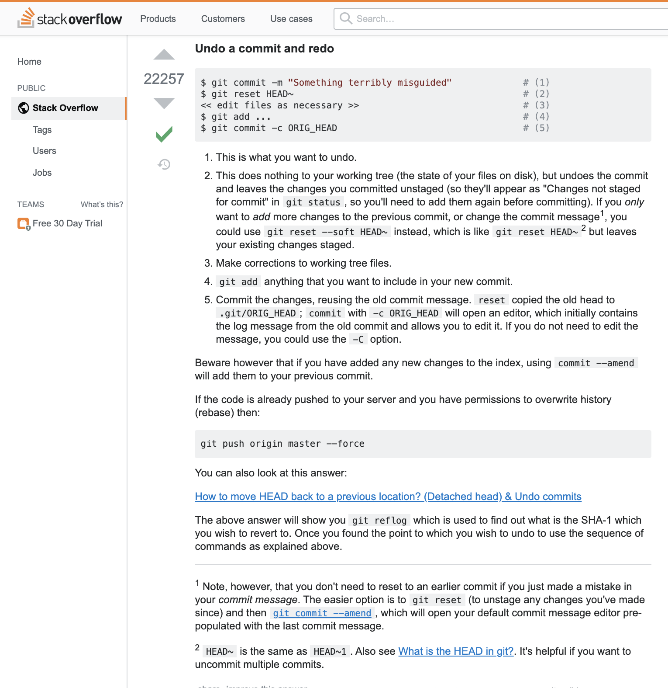
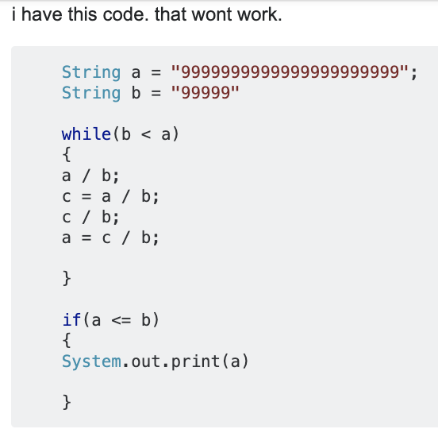

## Is Your Question Smart?

Smart questions are essential for software engineers to develop skills and become more enlightened with intelligence. The smartness of software engineers should reflect in their questions. After reading Eric Raymond’s essay on how to ask questions the smart way, I learned that in order for effective communication to exist within an open source community, certain guidelines must be followed. For example, questions should be precise, informative, and sent in accessible formats. Software engineers should develop refined problem-solving skills that will assist them when coding, debugging, and working on projects. Although one might be desperate for an urgent response, taking the time to carefully craft a question is fundamental. Programmers should not fear asking questions, because with every questioned answered, more comprehension is gained. Asking questions in a smart approach is a vital technique that should be utilized by the masses. 

## How to Git the Answer You Need

[Smart example](https://stackoverflow.com/questions/927358/how-do-i-undo-the-most-recent-local-commits-in-git)

StackOverflow is a website where programmers ask questions and (hopefully) receive answers.
In this example, the question being asked is: “I accidentally committed the wrong files to Git, but I haven't pushed the commit to the server yet. How can I undo those commits from the local repository?”. It received 20530 upvotes. It did not place blame on the application and is properly written. It shows crisp details of the process that the programmer went through. The question also provided more information by having a link to Git, in case someone reading the question was unaware of the usage of the git configuration management system. Large amounts of code or data were not dumped onto the readers. The symptoms of the problem and goals of the inquiry were explicitly stated. Proper tags were also included. Additionally, the header was specific and meaningful by stating the application of interest and the specific scenario of undoing the most recent commit on Git. This increased the ease of a reply. 

The responses to this question contributed substantial help to the developer in need. The responder took a lot of time to provide two options and a step-by-step process on how to undo a commit and redo. This exhibits that when a question is asked in a smart way, effective help follows as a result. The developed got the desired accurate answer, indicated by the green checkmark, which shows that the developer accepted the answer as correct. Notes and precautions were also offered. There are also 22257 upvotes on the answer, showcasing that numerous users found the solution to be useful as well. 

## Not So Smart  

[example](https://stackoverflow.com/questions/24722329/im-new-to-programming-in-java-and-my-code-wont-work-any-tips-please)

Q: “i created this problem my self and i want this to work but it wont. can anyone please give me some advice?”

A: “Debugger is there, and for free. Use it.”

A: “You need to follow a tutorial first”

In this scenario, the novice programmer provided the code that was being worked on using the Java programming language. The programmer needed help to divide two large numbers. However, the question revealed that the programmer had insignificant familiarity of how to code or write in English. For example, the variable c that was used in multiple lines was never declared. The question was careless and sloppily written. In addition to the spelling, grammar, punctuation, and capitalization errors in the question, the person asking the question lacks knowledge of basic Java programming skills, such as adding a semicolon at the end of a declaration statement, properly placing curly brackets to compile with coding rules, and the difference between a string and an integer. The programmer was not professional in his writing and should have taken time to properly construct his sentences. Although the programmer showed some courtesy by using the word “please”, the question was not clear or precise. According to Eric Raymond, polite ambiguity is valued less than being technical and descriptive. Also, those who wrote a solution were not thanked. The question may also be seen as a pointless query because it was asking for others to debug code without the type of problem. 

Therefore, the initial responses to this questioned were not helpful. The first three comments were one line each and essentially told the programmer to learn how to code and utilize the debugger instead of Stack Overflow. The programmer made the question hard to reply to due to the immense amount of errors in code and writing. The responses depicted that time is not meant to be wasted by answering thoughtless questions. The question has -2 upvotes, which shows that it was unclear and displayed no research effort. Efficient help was not a result. 

## The Pursuit of Knowledge  

>*"If I had an hour to solve a problem and my life depended on the solution, I would spend the first 55 minutes determining the proper question to ask, for once I know the proper question, I could solve the problem in less than five minutes."*
- Albert Einstein

As a result of this experiment, I have learned the importance of asking questions the proper way, in order to gain key insight. People have a higher probability of getting their important questions answered with a high-quality response, if the query is asked in a courteous and insightful manner. When asking for help, one should assure that time of others is appreciated and not wasted. Knowledge is power, and this power can be used to apply programming concepts and utilize technology, in order to make the world a better place. Therefore, smart software engineers ask smart questions that lead to smart solutions.  
