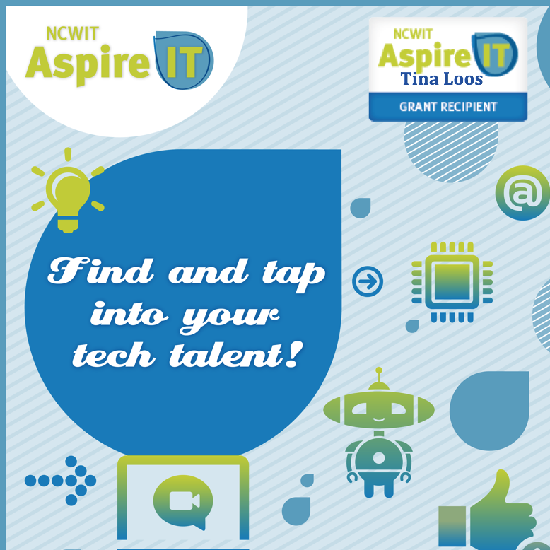

  

For my Senior Project in High School, I conducted qualitative research on the applications of artificial intelligence and its ethicality in society. I examined a branch of computer science striving to simulate the intelligence and behavior of humans as it paves goals for machines to understand, analyze, and respond to human activity through the eyes of three professionals: two PhDs working in AI and a deep learning programming engineer. The results of interviews show that AI continues to evolve in human achievement tools in aerospace, cyber defense research, healthcare, and disparate data. With this knowledge, I desired to give back to the community by sharing my findings and passion for computer science with younger generations, in order to spark their interest in the technological sector. 

As an Aspirations in Computing [Award Recipient](https://www.aspirations.org/user/103486)(National Honorable Mention; 2x Hawaii Affiliate Winner), I applied and received a grant of $3000 from the National Center for Women and Information Technology to create and implement my AspireIT K-12 Outreach after-school program: IT (Information Technology) Girls. 

I marketed the program utilizing email groups and worked closely with the special programs’ director, elementary school principal, and robotics team to contract snacks, teaching space, transportation, and STEM materials, including new [Vex Robotics kits](https://www.vexrobotics.com/) and [Z-Space 3D Virtual Reality Computers](https://zspace.com/). I taught coding, fundamentals of computer science, and computational thinking using the AspireIT curriculum: [Computer Science-in-a-Box](https://www.ncwit.org/resources/computer-science-box-unplug-your-curriculum-2018-update), [Google CS First Projects](https://csfirst.withgoogle.com/s/en/home), [Pencil Code](https://pencilcode.net/), [Scratch](https://scratch.mit.edu/), [Khan Academy](https://www.khanacademy.org/hourofcode) and [Sphero](https://www.sphero.com/). I also invited two guest speakers and organized two field trips to the Microsoft Store and Apple Store. This was administered in order to conduct experiments, do hours of hands-on coding, and show career discovery opportunities. I learned leadership, organization, collaboration and public speaking skills that will be beneficial as I work in teams for computer science projects. I gained knowledge of the opportunities in information technology while developing confidence and increasing awareness of current social issues.

IT Girls exposed middle school girls to technology in an exciting way that expressed their creativity through programming and learning. They worked towards bridging the gender gap of girls in information technology (IT) through continued class selection in science, technology, engineering, and math. With the developed curriculum, participants engaged in a fun, learning environment focused on the various aspects of computing, ranging from the fundamentals of computers to programming. Participants discovered why computer science is an important part of society and how developing skills will empower them to pursue careers in the fields of information technology, computing, and STEM (Science, Technology, Engineering, and Math). Through this, I was motivated to pursue a degree in computer science, to create innovative projects that will positively affect the world. 

You can learn more about how to become an [AspireIT Leader](https://www.aspirations.org/aspireit/leader). 
