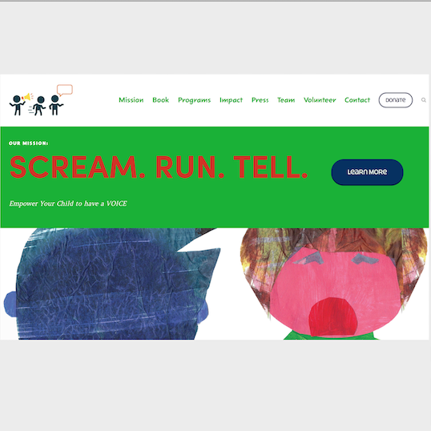

Scream. Run. Tell. is an organization that creates books and organizes workshops to teach children skills needed to protect themselves in times of danger. Through my volunteer work at the YWCA O'ahu, I was asked to re-design a website for the organization, to better reflect their values and personality. The [original website](https://srtell.org/) design was dark-themed and not colorful enough to reflect the personality of the ogranization. After learning about the mission and community impact of the company, I determined that the site needed to showcase their public works while being more appealing to children, since that was the demographic of concern. The project i was tasked with was to update their social prescence and means of spreading information on the web. 

During the summer of 2018, I worked with the Founder and CEO of the organization. I was in charge of gathering all of the data and information from the original site, and transfering it over to the new site. I also inputed updated information and images. The CEO wanted to re-vamp the organization's brand, while keeping true to their history. My role was to add drop-down buttons on the home page for the organization's mission, book, programs, impact, press, team, volunteer opportunities, and update the contact and donate buttons. The contact button allowed the user to directly link to sending an email, rather than the previous version of having to copy-and-paste the email address. I attended daily meetings with the CEO, to show my progress and make any necessary changes. I implemented a color scheme that directly correlated to that of the book. 
 
The project helped me learn how to style and implement a web site, using templates that also fostered creativity. The website design was creates using [SqaureSpace](https://www.squarespace.com/), a drag-and-drop platform for website building and hosting. I learned about human-computer interation and the significance of proper web design, so that users can navigate sites with ease and have a positive interation with their devices. Websites are fascinating because they use the world wide web to reach people all around the world. Additionally, I became aware of the importance of functionality, ease of opporation, and aesthetics in User Interface Design. I increased my expertise in graphic design by re-coloring the organization's logo. Furthermore, I learned about marketing and business, in order to produce a site that would attract many customers. I gained an appreciation for entreprenuers and learned a pleathora of information on how to the community can get involved to prevent children from becoming vicitms of child abuse.   
