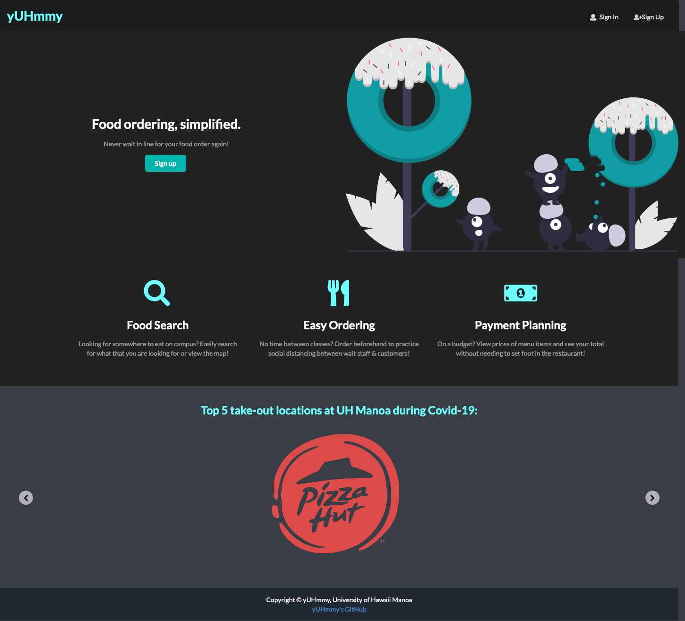
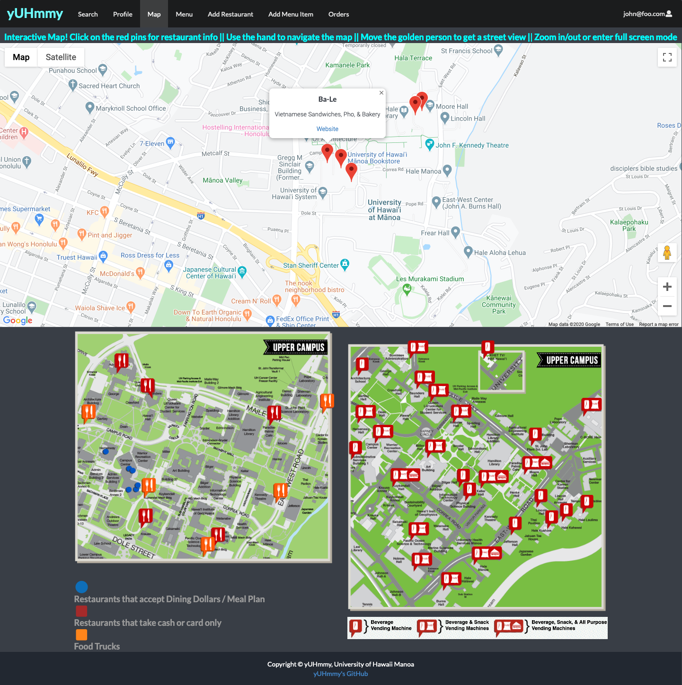
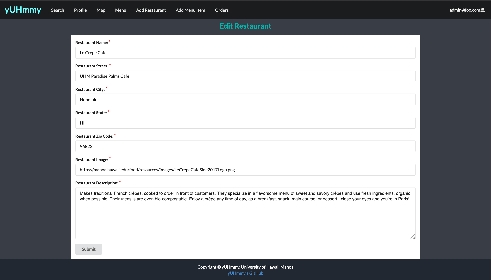

### UH Food Ordering & Restaurant Finding, Simplified

Overview: For my ICS 314 final project, my team and I created a web application called yUHmmy with the mission to implement social distancing for students on campus. Looking for somewhere to eat? There are many options on campus and in the surrounding Manoa area. Our platform puts them all in a single site and eliminates in-person and in-line waiting for customers by automating the process. Hungry students never have to wonder what restaurants are near UH, what food items are being sold at each place, or how much money they will have to pay for each item and in total. With the Covid-19 Pandemic among us, you may select what food items you would like to quickly pick up at restaurants.

Here are the features of the application:

* View available restaurants on campus and in the Manoa area
* View items on the menu, food descriptions, and prices at each location
* Search for the type of food you desire and find possible restaurants
* Order the food items that you are craving
* Create a profile page with food preferences and user information
* Rate restaurants with stars and provide your written feedback
* Integrated map functionality to discover top Manoa food locations
* Restaurant admin / vendor can view all orders in the queue
* Users check the queue to see if their order is ready
* The “I’m feeling hungry” button suggests where to eat, based on your preferences
* Today’s top 5 picks slideshow on homepage

### Front-End + Back-End
 My contributions to this project included both front-end and back-end development. I implemented the landing page and its features, created the map page, made the add, edit, and review pages for the restaurants/menu items, and inputted majority of the restaurant and menu information into the database. I helped cleaned up the site and some admin vs student privileges, as well as assisted with UI design on some features. Additionally, I designed our GitHub's [logo](https://github.com/yuhmmy), came up with the app name "yUHmmy, and I was in charge of our [project page](https://yuhmmy.github.io/) where I updated all of the information there for each milestone. 

I created the map page to further help users navigate and find restaurants at and around UH Manoa. The first part of the page is an interactive map feature using Google Maps. The top 5 take-out locations at UH Manoa during Covid-19 are included as clickable red pins on the map. Each pin shows the restaurant name and description. By clicking “website” on the pop-up, users are redirected to the UH Manoa page of the restaurant to view its hours of operation, menu, summary, phone number, and pictures of food options. Users can move the map around to see other dining places in the area, which are indicated by the orange pins. (As with Google Maps, users can view it in different modes, magnifications, or move the person for a street view). The second half of the page shows pins of all of the eating places on campus (including vending machines and food trucks), with a key so that users can decide by payment option, proximity, or availability.

While making the landing page, I ensured that there was a call to action with the sign up button and a description of the three main features of the application. I also included a slideshow of the top 5 take-out locations at UH Manoa during Covid-19 that loops on the second half of the screen, giving users suggestions on where to eat, based on what is popular with other students. On the search page, I assisted with the UI of the cards and designing the search features. I added the buttons and feature where users can select how many stars they would rate each restaurant, or click “review” to be redirected to give more feedback on the restaurant review page. For the different forms that I was in charge of making, I learned about Meteor Method because when users submit forms to create or edit information, multiple collections must be updated to save the results. I also ensured that the necessary parts had a red astrict, so that the form would not be acceptable if this information was missing. Some slots were fill-in, while others were dropdowns. I also ensured that only admins/vendors had access to their respectable forms. 

### The Takeaways
<a href="https://yuhmmy.github.io/"><i class="large github icon"></i>yUHmmy Project Page</a> && <a href="https://github.com/yuhmmy"><i class="large github icon"></i> yUHmmy GitHub Repository</a>

This project helped me to grow as a software developer and teammate. I learned how to collaborate and work with other students as I strengthened my programming and communication skills. I learned more about Semantic UI, Meteor, React, HTML, CSS, JavaScript, MongoDB Collections, and deploying an application. I discovered the importance of having a realistic default dataset in terms of amount of data, and descriptions/entries. I personally inputed 130+ different restaurants/menu items into the database. The restaurants each included a name, photo, location, and description. Similarly, every menu item needed a name, photo, price, description, ingredients, and IDs that would determine the type of food it was, so that the restaurant it is being served at can be properly recommended. When this was in our settings.development.json file, the Meteor app was overwhelmed and would not load properly. Thus I learned how to implement the Assets mechanism.

Additionally, I broadened my understanding of [Issue Driven Project Management](http://courses.ics.hawaii.edu/ics314s20/morea/project-management/reading-guidelines-idpm.html) by learning about how this agile project management process helps us to set guidelines to that we can be responsible for our own work, stay on task, and accomplish our goals through the use of milestones and issues. This helped me to see what items needed to be accomplished and encouraged me to add more features to the app. Since my team and I were not able to meet in in person, we utilized Discord's chat and call services to discuss matters related to the project. Overall, this was a very challenging and time intensive project that I enjoyed working on. It showed me that there are many intricate components to creating a web application and allowed me to apply the concepts that have I learned throughout the semester.

